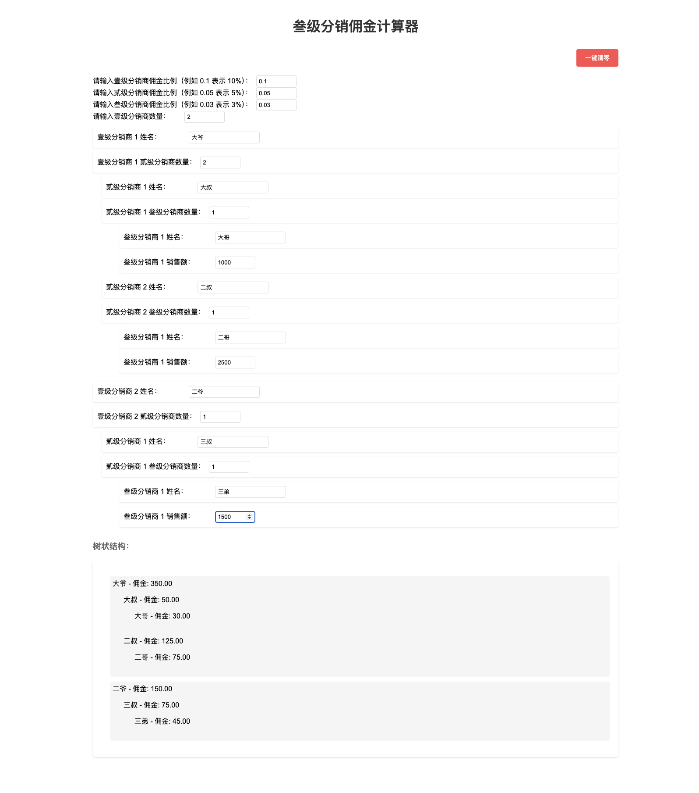

# 三级分销佣金计算器

这是一个支持三级分销佣金计算的工具，用户可以输入分销商的层级、销售额和佣金比例，系统将实时计算每级分销商的佣金，并以树状图展示分销结构和数据。

## 功能
- 支持三级分销层级结构。
- 根据销售额和佣金比例自动计算佣金。
- 动态展示分销商树状图。
- 支持修改佣金比例并实时更新。
- 数据重置功能，允许重新生成分销商结构。

## 安装
1. 克隆项目到本地：
   ```bash
   git clone https://github.com/username/repository.git
   ```
2. 进入项目目录：
   ```bash
   cd repository
   ```
3. 启动项目：
   - 直接打开 `index.html`。

## 使用方法
1. 打开项目后，输入一级分销商数量。
2. 输入每一级分销商的佣金比例、销售额等信息。
3. 查看生成的树状图和佣金计算结果。

## 项目截图


## 贡献
本项目代码大部分由AI生成
接下来希望继续开发用户输入分销商姓名的功能
欢迎贡献代码！请提交 Pull Request 或报告 Issue。

## 许可证
本项目遵循 MIT 许可证。

## 联系
如果有任何问题，请联系我：
- 邮箱：21421011@buaa.edu.cn

